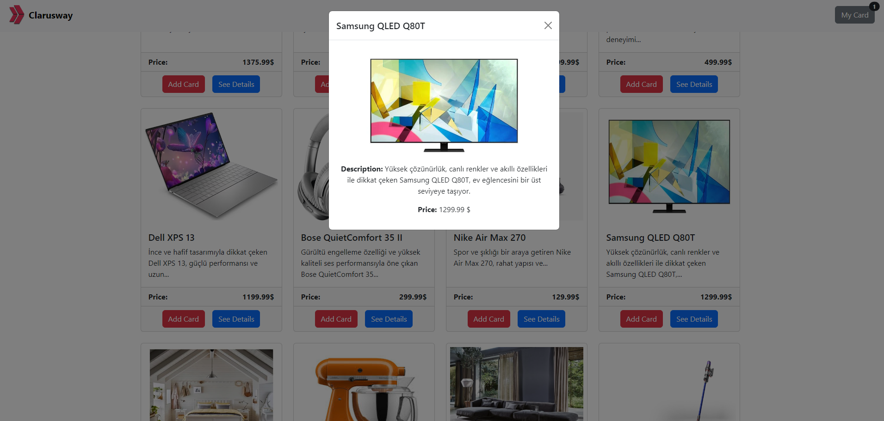
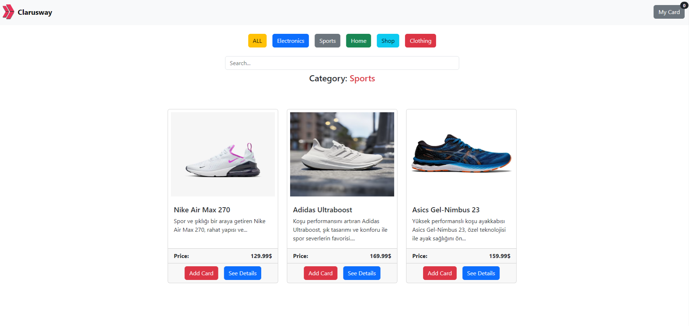
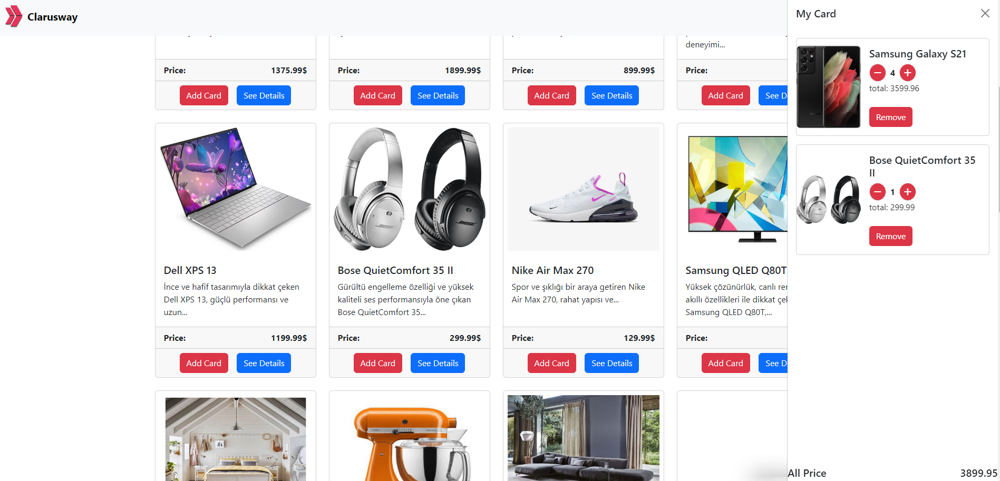

# shoppingApp
a basic e-commerce app ui with api

FEATURES:
-user can see details of product
-user can filter by categories or names by product
-user can add products to cart 
-user can increase or decrase amount of product

SCREENSHOTS:

